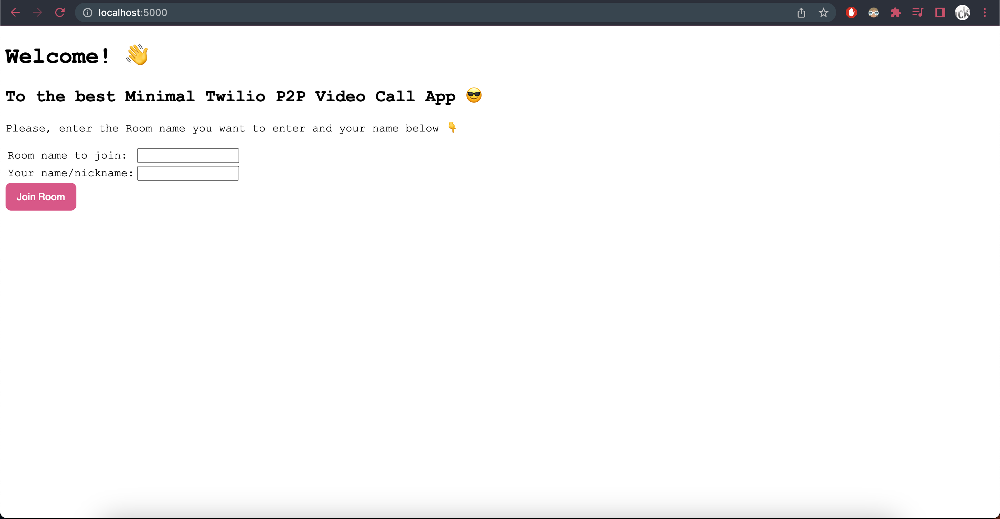
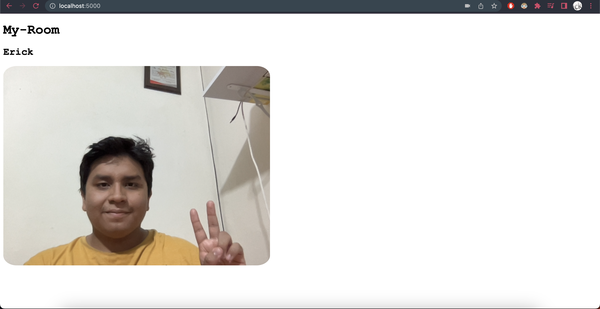
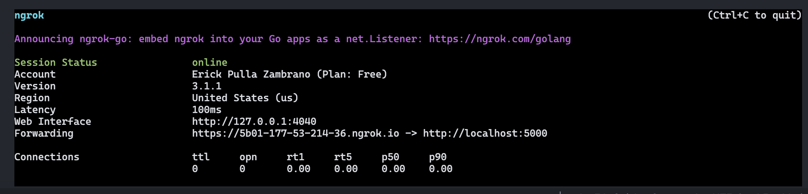
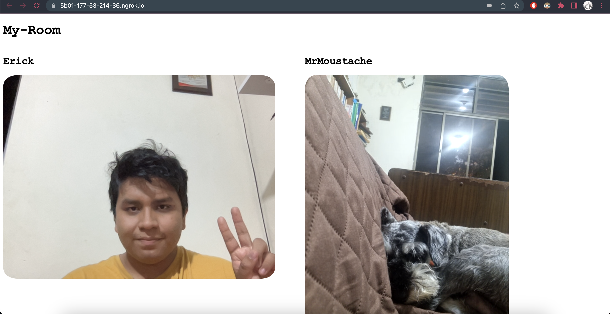

# Minimal Video Call App using Twilio, Python and Flask

Hi! This is a minimal application for videocalling (Peer-to-Peer) using [Twilio API](https://www.twilio.com/docs/).

## Requirements
- [python 3.9+](https://www.python.org/downloads/)
- [Twilio credentials](https://support.twilio.com/hc/en-us/articles/9318455807771-API-Keys-and-How-to-Change-Them)
    - Account SID
    - API Key SID
    - API Key Secret
- [ngrok](https://ngrok.com/)

## Installation

1. Create a `.env` (you can use `.env.example` as a template) in the root folder and add your Twilio credentials after the `=`:

```
TWILIO_ACCOUNT_SID=AXXXXXXXXXXXXXXXXXXXXXXXXXXXXXXXX2
TWILIO_API_KEY_SID=SXXXXXXXXXXXXXXXXXXXXXXXXXXXXXXXX7
TWILIO_API_KEY_SECRET=1XXXXXXXXXXXXXXXXXXXXXXXXXXXXXXx
```

2. Create a python virtual enviroment and install the requirements of the project located at `requirements.txt`:

```bash
# If you are on Linux/Mac
python3 -m venv .venv
source .venv/bin/activate
pip install -r requirements.txt

# If you are on Windows
python -m venv .venv
.venv\Scripts\activate
pip install -r requirements.txt
```

3. Run the flask app (by default, it is going to run on port `5000`):

```bash
# You can add --debug flag to enable Debug mode
flask --app app/app run
```

4. Visit http://localhost:5000. Now, you have your application running locally. Enter the Room name you want to join and your name/nickname and click on `Join Room`.






## Open to the public!

If you want your friends to join to your room remotely, you can use [ngrok](https://ngrok.com/).

Ngrok allows you to expose your service to the Internet.

1. Create an account to [Ngrok Dashboard](https://dashboard.ngrok.com/login) and follow the [set up instructions](https://dashboard.ngrok.com/get-started/setup). (Note: you will have to download ngrok cli in your computer)

2. Start your Flask application if you haven't already:

```bash
flask --app app/app run
```

3. Finally, execute the following command:

```bash
ngrok http 5000
```

4. You will see a ngrok output like this:



Copy the link from `Forwarding` row and share it to your friends.

5. Now, you and your friend can join into the same room using the same room name! Enjoy! 😊


